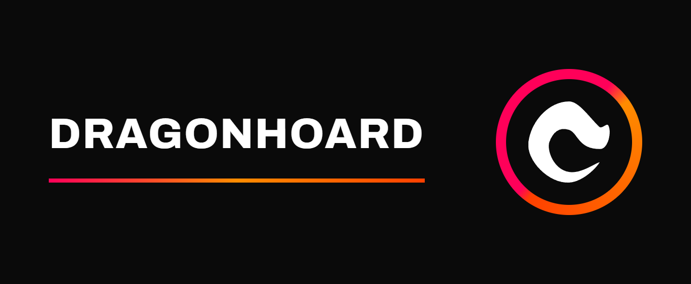

<p align="center">
  
</p>

# Dragonhoard

A Discord economy game, played a few slash commands at a time. Built with `discord.py` and SQLite.

Dragonhoard is a personal project in active development. The code is public to read and follow along with; it isn't (yet) pitched as a product or a hosted service.

## The game

Every server the bot joins gets its **own currency and its own economy** — nothing carries over between servers, and everything you own is yours alone.

The core loop:

1. **Mine** — `/mine place` puts a drill in the ground (your first Iron Drill is free). It mines on its own, online or not, pulling from a server-wide raw-material pool that tops up daily.
2. **Collect** — `/collect` empties everything your drills have produced into your inventory.
3. **Sell** — `/market sell` sells materials to the server for currency. The server is itself an economic actor: buying from players is the *only* way new currency enters circulation, and it resells its stock back at a markup via `/market buy`.
4. **Reinvest** — smelt ore in the `/furnace`, craft better gear in the `/factory`, compress materials into gems with the hydraulic `/press`, and upgrade your drills so the whole loop runs faster. Production fees burn currency back out of the economy.

Look anything up in-game with `/recipe` (the recipe book) or the built-in manual: `/help`, `/manual`, or `/man` — same book, three names.

And `/honk` plays a honk. No further questions.

### Commands at a glance

| Command group | What it does |
| ------------- | ------------ |
| `/mine place\|status\|remove\|attach\|detach`, `/collect` | Drill placement and harvesting |
| `/balance`, `/inventory` | What you have |
| `/market sell\|buy\|status` | Trade with the server |
| `/furnace smelt\|status\|queue` | Smelt ore (consumes coal) |
| `/factory craft\|upgrade\|status\|queue` | Craft gear and drill upgrades |
| `/press craft\|status\|queue` | Compress materials into gems |
| `/recipe factory <section>\|furnace\|press` | The recipe book |
| `/help`, `/manual`, `/man` | The in-Discord manual |
| `/setup currency\|fee\|max_queue\|messages` | Server-manager configuration |
| `/honk` | Honk |

By default every response is private (ephemeral) so the bot never clutters a channel; a server manager can flip that with `/setup messages public`.

## Project structure

```
dragonhoard/
├── bot.py                    # Entry point - run this to start the bot
├── config.py                 # Loads settings from .env
├── requirements.txt          # Python dependencies
├── .env.example              # Template for secrets (copy to .env)
├── dragonhoard.service       # systemd unit file for running as a background service
├── database/
│   ├── db.py                 # Async-safe SQLite wrapper
│   └── schema.sql            # Table definitions
├── data/
│   ├── materials.py          # Game balance data (drop rates, recipes, drill stats)
│   └── manual.py             # Text of the in-Discord manual served by /help
├── utils/                    # Helpers shared by all cogs
│   ├── db_helpers.py         # Common inventory/balance/stock queries
│   ├── drills.py             # Drill instance helpers
│   ├── embeds.py             # Embed colors, footer, field helpers
│   ├── formatting.py         # Currency/number display, job durations and ETAs
│   ├── guild_helpers.py      # Per-guild config lookups
│   ├── receipts.py           # Job receipt embeds
│   └── responses.py          # Public-vs-ephemeral response handling
├── assets/                   # Files the bot sends, plus branding (logo, banner)
├── docs/                     # Design docs (market, mining, stylization, deployment, ...)
├── tests/                    # unittest suite
└── cogs/                     # One file per command group ("cog" = discord.py's plugin unit)
    ├── setup.py              # /setup currency, /setup fee, /setup max_queue, /setup messages
    ├── economy.py            # /balance, /inventory, /market sell|buy|status
    ├── mining.py             # /mine place|status|remove|attach|detach, /collect
    ├── furnace.py            # /furnace smelt|status|queue
    ├── factory.py            # /factory craft|upgrade|status|queue
    ├── press.py              # /press craft|status|queue (the hydraulic press)
    ├── recipe.py             # /recipe factory|furnace|press (the recipe book)
    ├── manual.py             # /help, /manual, /man (the same manual under three names)
    └── fun.py                # /honk (and anything else that's purely for fun)
```

## Running it

Short version, for anyone comfortable with Python:

```bash
git clone <this repo> dragonhoard && cd dragonhoard
python3 -m venv venv && source venv/bin/activate
pip install -r requirements.txt
cp .env.example .env   # then fill in your bot token
python bot.py
```

You'll need a bot application from the [Discord Developer Portal](https://discord.com/developers/applications) with the **Server Members Intent** enabled (the bot uses member counts for mining-pool top-ups and market pricing).

The long version — a start-to-finish beginner walkthrough covering Proxmox LXC setup, a dedicated service user, and running permanently under systemd — lives in [docs/deployment.md](docs/deployment.md).

## Tests

```bash
python -m unittest discover tests
```

## License

Dragonhoard is licensed under the [GNU Affero General Public License v3.0](LICENSE) (AGPL-3.0). In short: you're free to run, study, modify, and share this code, but if you run a modified version as a service for others, you must make your modified source available too.

Copyright © 2026 Isaac Day
